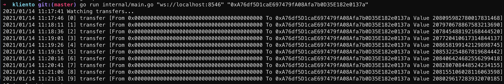

# Kliento 

Kliento (/client in esperanto/) is a set of client libraries for Celo in Golang. It is a ported library from [ContractKit](https://github.com/celo-org/celo-monorepo/tree/master/packages/contractkit) and only supports a subset of what ContractKit does.

## Usage

Kliento is most useful for tight integration with contract bindings and historical queries.

See [examples](./internal/examples) for some code samples demonstrating common use cases.

For sending contract transactions in consumer applications, we recommend using [ContractKit](https://docs.celo.org/developer-guide/overview/introduction/contractkit).

## Development

Use `make gen-contracts` to update the abigen bindings to the build artifacts from local monorepo.

Use `make gen-registry` to update the generated registry bindings to a list of contracts specified in the [template script](`registry/internal/gen-registry.go`).
